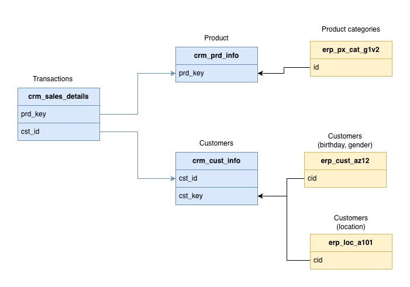

# SQL Data Warehouse Project (PostgreSQL)

## Overview

This project is an end-to-end Data Warehouse built from scratch using PostgreSQL.
It follows the Medallion Architecture approach (Bronze → Silver → Gold layers).

The project is inspired by *"SQL Data Warehouse from Scratch"* by Data with Baraa, but implemented using PostgreSQL instead of SQL Server.

---

## Architecture

The warehouse is divided into three layers:

* **Bronze** – raw data ingestion from source systems (CRM, ERP)
* **Silver** – cleaned and transformed data
* **Gold** – business-ready views for analytics




---

## Tech Stack

* PostgreSQL 16
* Docker & Docker Compose
* SQL (data modeling, transformations)
* CSV files as source data

---

## Project Structure

```
sql/
  bronze_table_creation.sql
  bronze_load.sql
  silver_transform.sql
  gold_views.sql

datasets/
  source_crm/
  source_erp/

docker-compose.yml
```

---

## How to Run

1. Start the database:

```bash
docker-compose up -d
```

2. PostgreSQL will automatically:

* create schemas
* create tables
* load and transform data

3. Connect to DB:

* host: localhost
* port: 5432
* db: warehouse
* user: postgres
* password: postgres

---

## Data Sources

* CRM system (customers, products)
* ERP system (transactions, sales)

---

## Goals of the Project

* Practice building a data warehouse from scratch
* Learn Medallion Architecture
* Implement ETL using pure SQL
* Work with PostgreSQL in a realistic setup

---

## Example Use Cases

* Sales analysis
* Customer segmentation
* Product performance tracking

---

## What I Learned

* Data modeling (fact & dimension tables)
* Data cleaning & transformation in SQL
* Structuring layered data pipelines
* Working with Docker for data projects

---

## Future Improvements (optional)

* Add orchestration (Airflow)
* Add dbt for transformations
* Add tests & data quality checks

---
